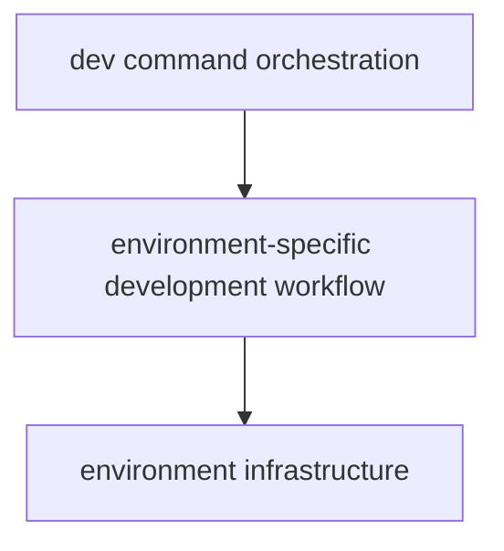
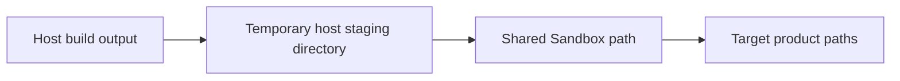
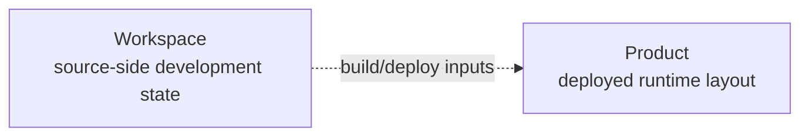
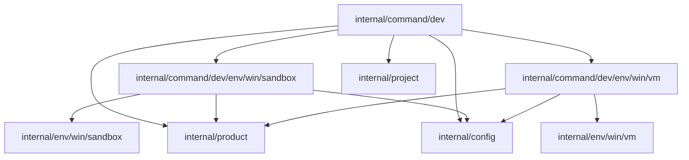
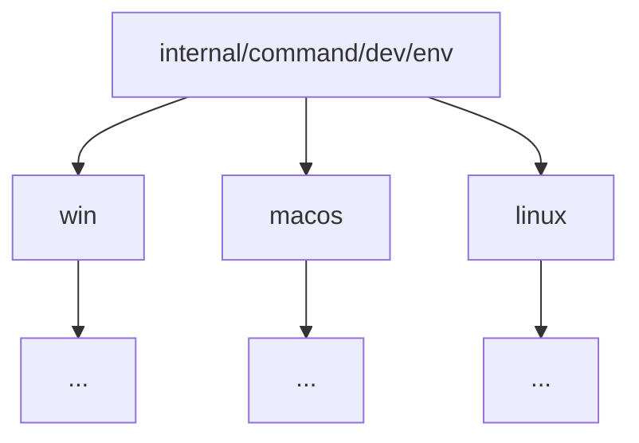

# Architecture

This document describes the current architecture of Scriptorium CLI and the design boundaries behind the `orium dev` workflow.

The architecture is intentionally small and evolves from real development pressure rather than from speculative abstraction.

---

## Overview

At a high level, the current development workflow is split into three layers:



Each layer has a different responsibility:

- the top-level `dev` command decides what the development workflow is
- environment-specific commands decide how that workflow is carried out in a particular environment
- infrastructure packages provide low-level VM or Sandbox mechanics

This keeps Scriptorium-specific orchestration separate from virtualization details.

---

## Top-Level Development Command

The top-level development command lives in:

```text
internal/command/dev
```

Its main responsibility is orchestration.

It owns the source-side and target-side concepts used by the workflow:

```go
type devCommand struct {
    workspace  *project.Workspace
    product    *product.Product
    envCommand envCommand
}
```

The development command is responsible for:

- loading workspace configuration
- loading product configuration
- selecting the requested development environment
- building the Scriptorium workspace
- running project tests
- passing build artifacts and other required inputs to the selected environment-specific command
- coordinating the complete lifecycle of the development session

The current high-level flow is:

```text
Ensure environment is available
        ↓
Build Scriptorium
        ↓
Run tests
        ↓
Prepare environment
        ↓
Prepare product prerequisites
        ↓
Deploy artifacts and dictionary
        ↓
Start product
        ↓
Start manual tests
        ↓
Monitor environment
        ↓
Cleanup environment
```

The top-level command does not need to know how VMware or Windows Sandbox implement these operations.

---

## Environment Command Contract

The `dev` package defines a small contract describing what the top-level development workflow needs from an environment-specific implementation.

Conceptually:

```go
type envCommand interface {
    EnsureEnv() error
    PrepareEnv() error

    SetupProductPrerequisites() error
    DeployArtifacts(
        artifacts *project.Artifacts,
        dictionarySourcePath string,
    ) error
    StartProduct() error
    StartManualTests() error

    MonitorEnv() error
    CleanupEnv() error
}
```

This interface belongs to the consumer: the `dev` command.

It exists because `devCommand` needs to orchestrate multiple environment-specific implementations without knowing their concrete types.

The concrete implementations do not need to depend on this interface directly. Go's implicit interface implementation allows them to satisfy the contract structurally.

Compile-time assertions in the `dev` package verify that the current implementations continue to satisfy the contract.

---

## Environment-Specific Commands

Current environment-specific development workflows live under:

```text
internal/command/dev/env/win/sandbox
internal/command/dev/env/win/vm
```

Each package exposes a `Command` type.

For example:

```text
sandbox.Command
vm.Command
```

These commands sit between the generic development workflow and the concrete infrastructure API.

They understand:

- the Scriptorium product layout
- how to deploy the locally built artifacts
- how to start Scriptorium
- how manual testing should be initiated
- which infrastructure capabilities are available in their environment

They intentionally do not own the whole source workspace.

The top-level `dev` command owns `project.Workspace` and passes only the inputs the environment-specific workflow actually needs, such as:

- built artifacts
- the dictionary source path

The environment-specific commands do retain `product.Product`, because the target product layout is directly relevant to deployment and startup.

---

## Windows Sandbox Command

The Sandbox development workflow lives in:

```text
internal/command/dev/env/win/sandbox
```

It uses the concrete Sandbox infrastructure implementation from:

```text
internal/env/win/sandbox
```

Its responsibilities currently include:

- preparing product directories
- staging host build artifacts
- sharing the staging directory with Windows Sandbox
- copying artifacts into the target product layout
- deploying the dictionary
- registering Brush
- starting Inkstone
- starting Ink with the configured WebView2 runtime
- creating the manual test file
- opening the manual test environment

Windows Sandbox requires a staging step because the locally built artifacts originate on the host while the product runs in an isolated Sandbox instance.

Conceptually:



---

## VMware Command

The VMware development workflow lives in:

```text
internal/command/dev/env/win/vm
```

It uses the concrete VMware infrastructure implementation from:

```text
internal/env/win/vm
```

Its responsibilities currently include:

- preparing product directories
- deploying build artifacts directly into the VM
- deploying the dictionary
- registering Brush
- starting the configured development use case

The VM implementation can use the VMware tooling directly for file and process operations, so it does not require the same staging model as Windows Sandbox.

---

## Environment Infrastructure

Low-level environment mechanics live under:

```text
internal/env
```

Windows implementations currently include:

```text
internal/env/win/sandbox
internal/env/win/vm
```

These packages are infrastructure-oriented.

They provide capabilities such as:

- checking environment availability
- preparing an environment
- monitoring its lifecycle
- cleaning up or resetting state
- creating files and directories
- copying files
- running programs
- executing commands
- sharing folders where supported

They should not contain Scriptorium-specific orchestration.

For example:

- a Sandbox knows how to share a folder
- it should not need to know what Brush or Ink is
- a VM knows how to run a program
- it should not need to know what the Scriptorium development use case means

This keeps platform mechanics reusable and keeps product knowledge in the command layer.

---

## Environment Lifecycle Contract

The infrastructure environments expose the same public lifecycle shape:

```go
EnsureAvailable() error
Prepare() error
Monitor() error
Cleanup() error
```

The implementations are intentionally different internally.

For example:

```text
VM Prepare
    reset to snapshot
    start VM
```

while:

```text
Sandbox Prepare
    start Sandbox
    connect interactive session
    prepare runtime dependencies
```

The public API expresses lifecycle meaning rather than exposing every internal lifecycle operation.

Internal operations such as starting, stopping, connecting, resetting, or probing state remain private to their respective infrastructure packages where possible.

---

## Workspace

The source workspace is represented by:

```text
internal/project
```

The workspace represents the local Scriptorium source tree and is responsible for source-side operations such as:

- locating component repositories
- building components
- running their tests
- returning build artifacts
- locating source-side resources such as the dictionary

The workspace remains owned by the top-level `dev` command.

Environment-specific commands should receive only the source-side values they actually need rather than depending on the entire workspace.

---

## Product

The target product layout is represented by:

```text
internal/product
```

The product describes where Scriptorium should live inside the selected development environment.

It includes locations for concepts such as:

- Brush
- Inkstone
- Ink
- dictionary
- logs
- local state
- artifact directories

The distinction between workspace and product is intentional:



This keeps build concerns separate from deployment concerns.

---

## Configuration

Configuration is loaded through:

```text
internal/config
```

Different configuration domains are loaded independently, including:

- workspace configuration
- product configuration
- VMware configuration
- Windows Sandbox configuration

The top-level development command owns configuration that defines the overall development workflow, while concrete environment commands load configuration specific to the environment they instantiate.

This avoids making a VM or Sandbox responsible for source-workspace decisions.

---

## Dependency Direction

The intended dependency direction is:



Environment-specific commands may depend on:

```text
product
project artifact types
environment infrastructure
environment-specific configuration
```

The low-level infrastructure packages should not depend on the Scriptorium command layer.

---

## Interface Design

Interfaces are introduced only where there is an actual consumer that benefits from not knowing the concrete implementation.

The current example is `envCommand`.

The important design question is:

> Who needs to not know the concrete type?

For the current architecture, the answer is the top-level `devCommand`.

By contrast, the Sandbox-specific command naturally knows it is using a concrete Sandbox, and the VM-specific command naturally knows it is using a concrete VM.

Therefore these layers continue to use concrete types rather than forcing every infrastructure capability behind a generic interface.

---

## Package Naming

Environment-specific workflow packages use short package names:

```text
sandbox.Command
vm.Command
```

rather than repetitive names such as:

```text
sandbox.SandboxCommand
vm.VMCommand
```

Where a workflow package needs to import an infrastructure package with the same package name, aliases are used to make the distinction explicit:

```go
sandboxenv "github.com/ScriptoriumLab/scriptorium-cli/internal/env/win/sandbox"
vmenv      "github.com/ScriptoriumLab/scriptorium-cli/internal/env/win/vm"
```

This keeps package names concise while preserving clarity at the boundary between workflow and infrastructure.

---

## Current Design Principles

The current architecture follows several principles:

- ownership should remain explicit
- consumers define the interfaces they need
- concrete types are preferred where polymorphism is unnecessary
- infrastructure should expose capabilities, not product semantics
- source workspace and deployed product are separate concepts
- abstractions should follow real duplication and development pressure
- public APIs should express stable semantics rather than implementation details
- environment-specific differences should stay behind a stable user-facing workflow
- small refactoring steps are preferred over speculative redesign

---

## Known Areas for Further Evolution

The current structure is functional, but some areas are intentionally left for later refinement.

Examples include:

- failure-path cleanup semantics
- ownership of Sandbox temporary staging state
- richer error aggregation and diagnostics
- parallelizing host build work with environment preparation
- packaging and release workflows
- future macOS development environments
- additional `orium` commands such as `doctor`, `health`, `test`, and `perf`

These should evolve from concrete usage rather than being generalized prematurely.

---

## Cross-Platform Direction

The first complete workflow targets Windows because Scriptorium currently integrates with the Windows Text Services Framework (TSF).

The architecture is intended to preserve a stable developer-facing command model while allowing platform-specific workflows underneath it.

A future structure may grow toward environments such as:



The exact shape should be driven by the needs of each platform rather than by forcing them into identical implementations.

The long-term goal remains:

> one developer toolchain, with platform-specific mechanics hidden behind clear workflow boundaries.
